# Intelligent parking system

**Course ID**: 12740

**Group ID** : AM

**Group Member**: Zhaocheng Du, Wenying Feng, Zhen Cai

**Video Link**: [Click here](https://www.youtube.com/watch?v=oXcWU0CFHwE&t=9s)

   
## 1. Introduction

### 1.1 Background

With the rapid increase in the number of vehicles worldwide, car parking problem becomes one of the great contributor in congestion and fuel combustion. Due to the limited Parking spaces, current situation of most parking lots is unsatisfying, where accommodation of increasing vehicles is difficult and provides large inconvenience. Therefore, well-managed and convenience-driven car parks need to be developed, preventing problems from worsening. With an efficient and smart parking system, the level of convenience to the drivers will be greatly improved, and the related pollution may also be reduced. The figure below is from [this website](http://en.cesipc.com/news/7814691171.html)

  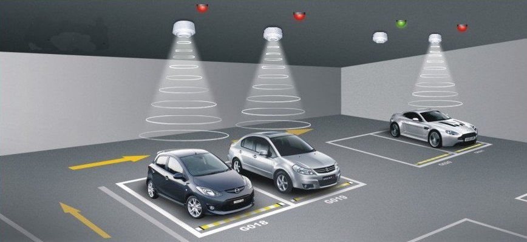

  Figure1. Intelligent parking system (conceptual）

Our project develops a demo of an intelligent parking system, which includes the nearest parking space location system with route planning, and a corner collision avoidance system. A real scaled-down parking lot model with 16 parking places is created, 4 of which are applied with photosensitive sensors inserted on the ground for vehicle detection. One ultrasonic sensor is applied on the pillar of the entrence for the collision avoidance system. Besides, IOV (Internet of Vehicle) along with audio guide function is also realized in this project through data transmitted from parking system (raspberry pi) to vehicles (use the computer as the vehicle command 

### 1.2 Motivation

In conventional parking lots, drivers need to look for a vacant parking space on their own, which is both time and energy consuming and not eco-friendly. Therefore, an intelligent parking system is proposed aiming to cut the time of finding a parking space by a location system. Another problem of corner edge abrasion in parking lots is also ubiquitous, especially when the path is too narrow for a vehicle to passing along, it is highly likely that scrapes take place between cars and pillars, which leads to high maintenance fee. Hence, a collision avoidance system is needed to prevent this kind of cases.

### 1.3 Goals

For the location system, the location of the nearest parking space and the shortest route to the this parking space will be figured out and information will be transmitted to the vehicle. For the corner collision system, if the car is too close to the sensor on the corner edge, the car will receive a warning. The audio system are available for both two systems.

## 2. Methodology

### 2.1 Phenomena of Interest

When the parking spot has been parked, the car will block out the light from the top so the photoresistor sensor at the center of the parking spot will sense no light at all.
When the vehicle enters the parking area, the distance detected by ultrasonic sensor will decrease suddenly, so the parking system will know there is a vehicle coming. And the distance detected by ultrasonic sensor can also be used to prevent friction collision between vehicles and the pillar.

### 2.2 Sensors Used

  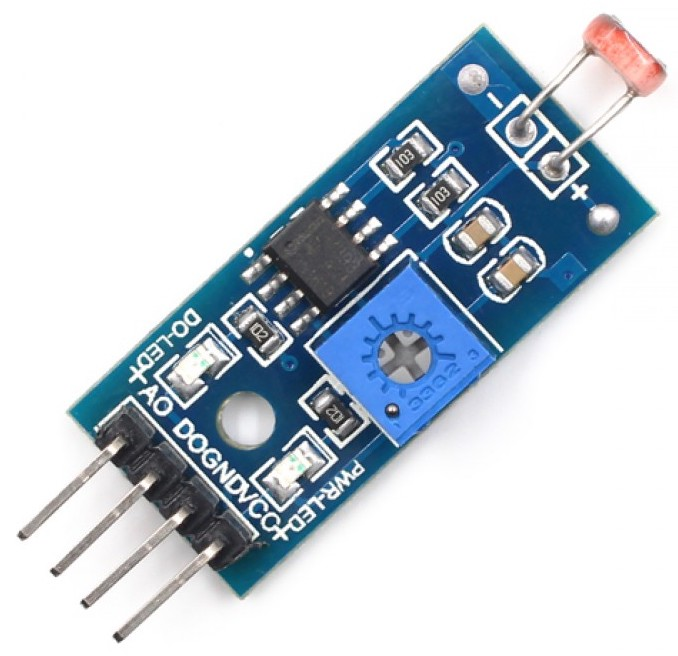

Photoresistor sensor module

Click [here](https://www.makerfabs.com/light-sensor-module.html) to view original figure

Parameters: 
* Can detect the brightness and the ambient light intensity
* Adjustable sensitivity
* Operating Voltage: 3.3V-5V 
* Output Format : DO digital switching outputs (0 and 1) and AO analog voltage output 
* Has a fixed bolt holes for easy installation 
* PCB Size : 3.2cm * 1.4cm 

  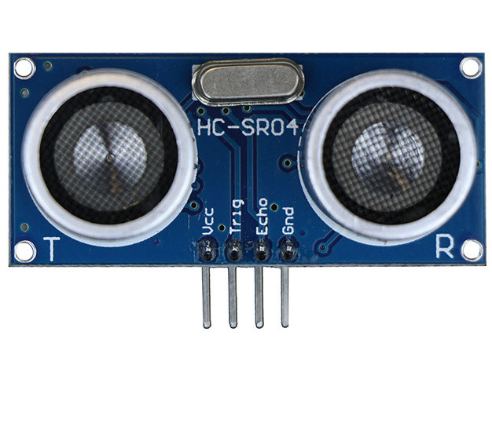

Ultrasonic sensor HC-SRO4

Click [here](https://www.kitronik.co.uk/46130-ultrasonic-distance-sensor-hc-sr04-5v-version.html) to view original figure

Parameters: 
*	Use voltage: DC5V 
*	Quiescent current: less than 2mA 
*	level output: high 5V low 0V 
*	Induction angle: no more than 15 degrees 
*	Detection range: 0.78~196 in/ (2cm~500cm) 
*	High accuracy: up to 0.12 in/(0.3 cm) 
*	Connection mode: VCC, trig (control), echo (receiving end), GND ground wire 

### 2.3 Signal Conditioning and Processing

When the ultrasonic sensor at the corner of the parking area entrance detects that the distance is less than the width of the entrance, it will automatically start planning the route for the entering vehicle. When the light sensor on the parking spot returns a signal that no light can be detected, the parking system will consider that the parking space has been parked. Map of this parking area has been stored in the parking system already and algorithms are used to calculate the nearest parking space and the shortest route whenever a vehicle is detected entering. At the same time, if the distance detected by the ultrasonic at the entrance is less than a certain value, an anti-friction alarm will pop up on the user interface and return the minimum distance.

## 3. Project design

Firstly, we designed the blueprint of our demo parking lot with CAD. The blueprint of this parking lot is designed with 16 parking spaces and 8 pillars. Four of these parking spaces will be added with the photosensitive sensors in order to fullfill the route planning function. One of these pillars will be equiped with ultrasonic sensor in order to test the collision-avoiding function. The layout of the parking lot is as figure3.1 (left). Since only one photosensitive sensor is provided in the toolkit, we brought other 3 Photoresistor sensors and one ultrasonic sensors from the internet. Then we used the carton made the parking lot model based on the blueprint we designed. The model is shown in the figure3.1 (right).

  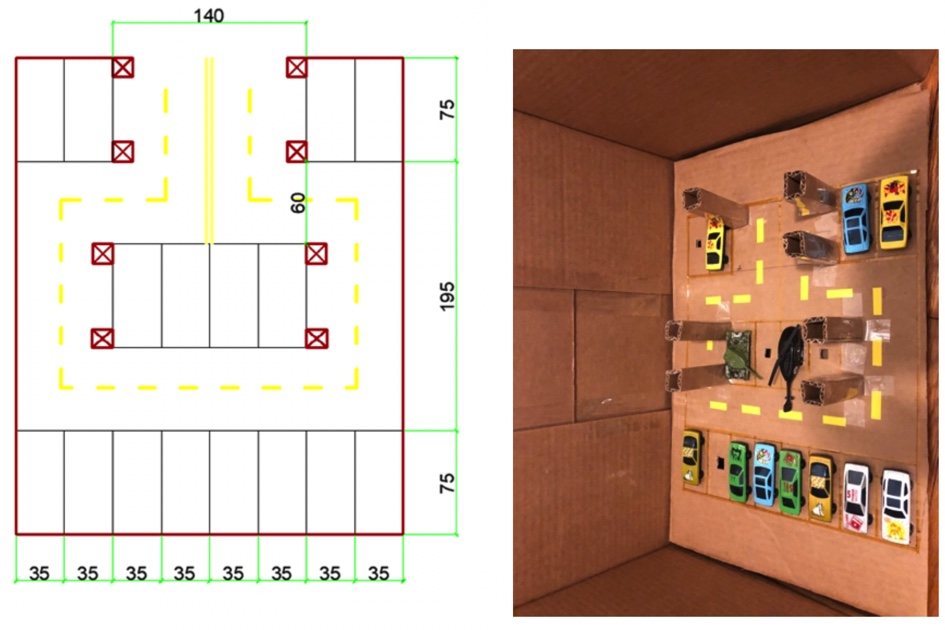

  Figure3.1 Layout of the parking space

Apart from the physical model. We also abstracted the physical model into a logical model based on the graph theory. We used points representting the entrence of each parking space and the conner. Then we used edges represent the route between different nodes. Finally, we modeled the parking lot with a network. The topology structure of this network is like figure3.2 (left). The center figure below shows the logical model overlay on the CAD blueprint. Once we had this logical model, we could apply many graph algorithms on this parking lot. In this project the most important algorithm is Dijkstra algorithm. For example, We programed some code to find the nearest parking space and the route to it which is shown in the right figure.

  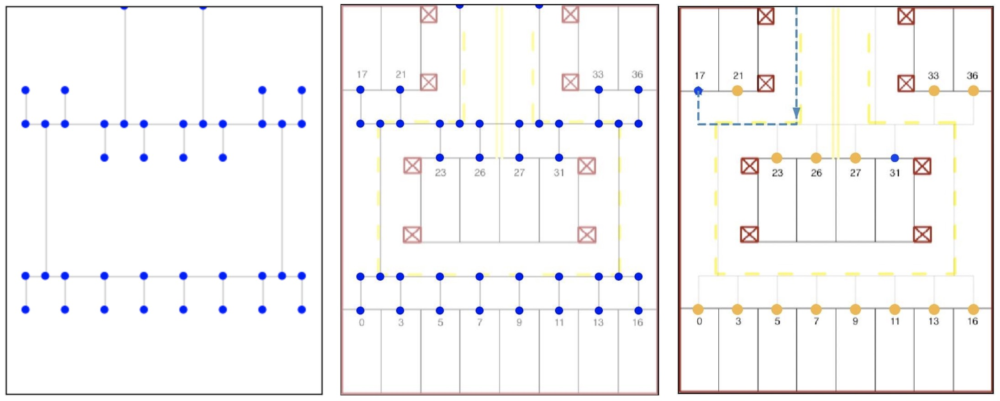

  Figure3.2 Construction the network of parking space

The next step is linking the logical model stored in the computer with the physical parking model using sensor techniques and data transmitting techniques. The first one we fullfilled is data transmitting which implement the function that transmit data from raspberry pi to PC using socket programming. We sent these data because we treat our PC as the embedded operating system in the privat car and treat the raspberry pi as the server used in the parking lot. The parking lot (raspberry pi) server will send the parking space information and collision information to the car (PC) so the car can make its own adjustment. The protocol is designed like the below figure After the design the car (PC) can receive the data sensored from the parking lot (raspberry pi) and knew its route planning information. in order to improve the user-friendly experience, we also added voice assistance for different events. Below is the communication protocal we designed.

  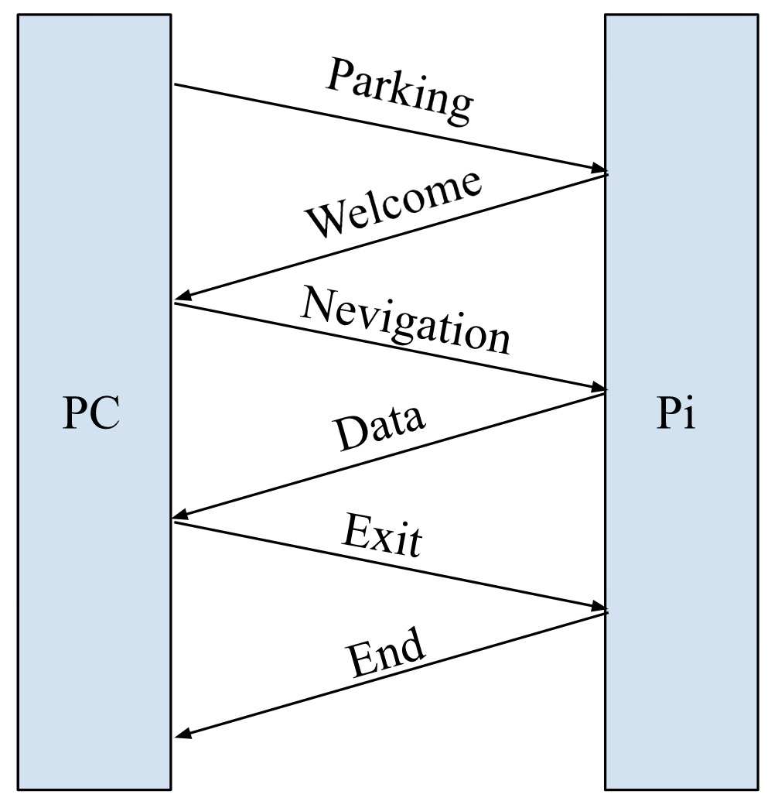

  Figure3.3 The communication protocal designed by us

Then we designed different classes for different actuator including a light sensor class, a Ultrasonic sensor class and a LED class. Each class links a specific channel and a specific parking space. The UML graph of these three classes are provided in figure3.4. This design enables us to link every light sensor to the parking space id and every Ultrasonic sensor to the pillar id. For example, a light sensor who connect to the channel 0 of MCP3008 and indicate whether there is a car in parking space 17 has the `LightSensor.channel = 0` and `LightSensor.stop_id=17`. If there is car in this parking space, the LightSensor.is_empty would be 1 else 0. Click [here](https://www.sparkfun.com/products/9590) to view the original LED light figure

  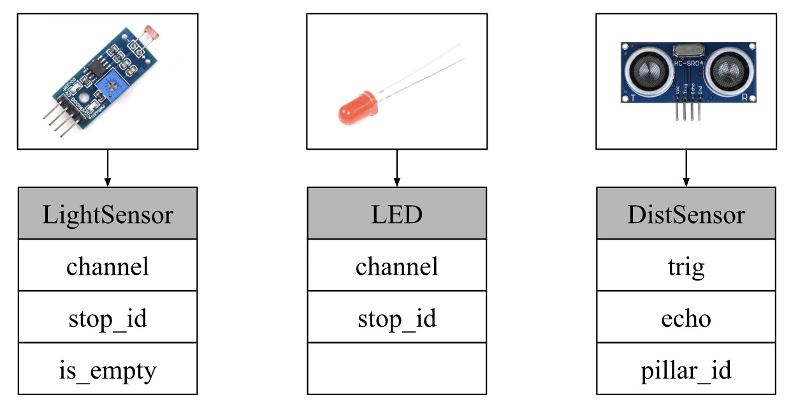

  Figure3.4 The UML diagram of differnence sensors

After assigned each class to each sensor. The next question we solved is the multiple data transmission problem. Since the server (Pi) would receive data from four light sensors and we Ultrasonic sensor. It has to encode this information and send to the private car (local computer) and also the private car needs to decode these data. Thus, we used the dictionary structure in python to store these data sensed in the server and send them to private car. And the car will do the data processing and find the shortest path. The data structure and transmission procedure is shown in figure3.5.

  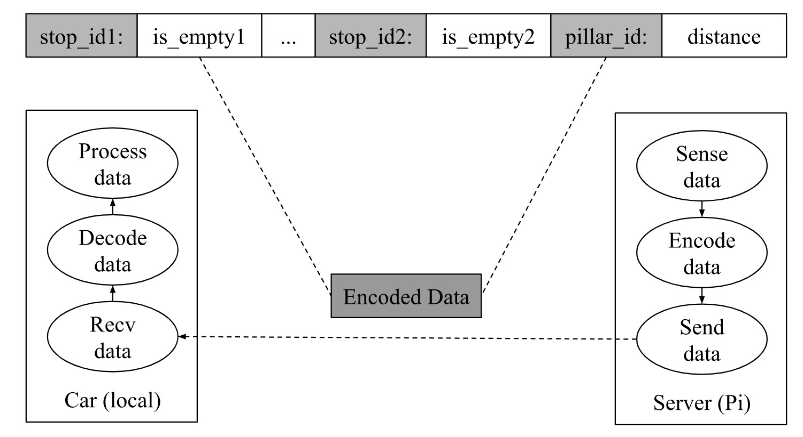

  Figure3.5  The data sending procedure

After deployed all the programming part. We connect the circuit. The circuit including four light sensors, four LED lights and one Ultrasonic sensor. In these actuators, four light sensors are used to sense the light intensity in four parking space. Four LED lights are used to show the nearest parking space for cars (i.e if a car enter the parking lot, the LED on the nearest parking space would be lighten, if the car had parked on the nearest parking space the LED light would be switch off). One ultrasonic sensor is installed on a pillar that near the entrance. It will sense the distance between pillars and the car. The circuit is connected as below.

  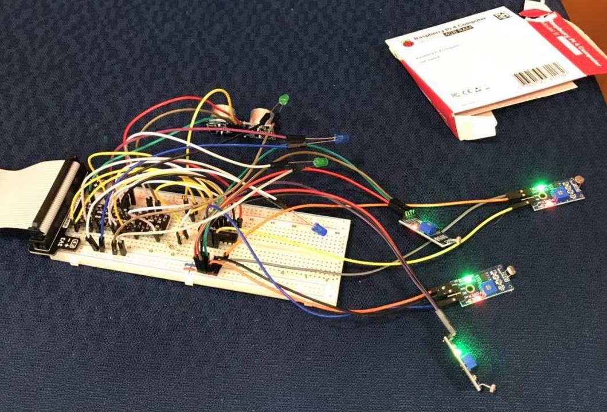

  Figure3.6 The connected circuit

Then we connected the circuit with our physical parking model. We linked the circuit with our physical parking model so that all the sensors are in the right places. In the following model. The circuit and Pi is hidden beneath the ground see figure3.7 (right) and all the actuators can access from the hole on the ground. We left four empty parking space to do the test and each parking space is equipped with one LED light and one light sensor (green box). And the pillar near the entrance is equipped with one ultrasonic (red circle).

  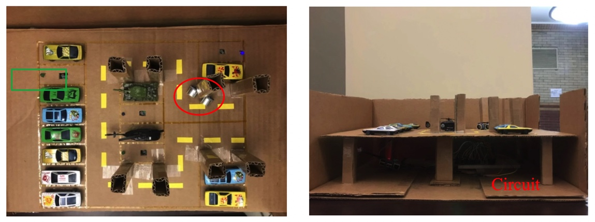

  Figure3.7 The physical model connected with circuit

There is one thing left that even though we have all the sensor in the right place and the sensor can work correctly, people cannot see the sensed data in real time. We try to connect all the light sensors to the openchirp website so all the light sensor data can be visualized on the openchirp website. We first used “wget” command download the “cacert.pem” file from the website. Then followed the tutorial set up our first device and used the template code fullfuilled the function of transmitting data to the openchirp website. The figure below is the visualization of light sensor.

  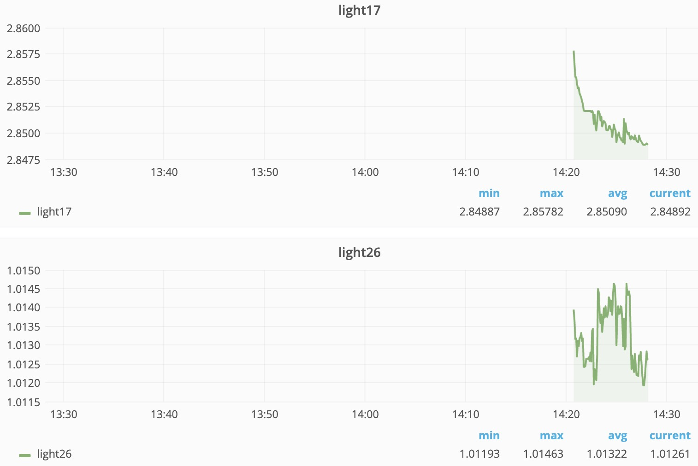

  Figure3.8 The openchirp interface  

Then we tested and debugging our code. And finally our project are down. The target parking space is shown in the physical model (the space with lighten LED) and the shortest route is shown in the right. In addition to this. It also equipped with the sound guidance.

  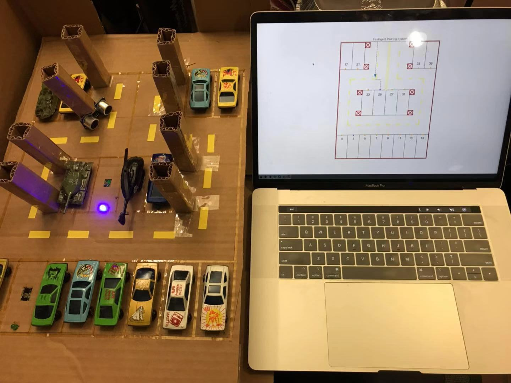

  Figure3.9 This project  

## 4. Experiment and result

At first, I ran the openchirp program backstage so the data can be send to the openchirp. We left four empty parking space and launched the program in the server (parking lot) and simulated the first car come into parking lot and launched the route plan program. In terminal it shows like this.

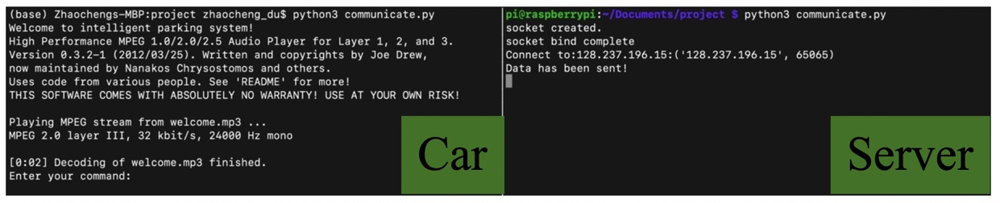

  Figure4.1 The ternimal in car (client) and server (Pi)  

Then if I enter the “NEV” command, the route planning, the nearest parking space selection and route planning program would launch and do the route planning function. In this situation, the nearest parking space is 26 so the program in the car’s system would plot the shortest route to 26 parking space and meanwhile the server would send out the signal to light up the LED light in the parking lot. There is also voice direction “Your nearest parking space is 26”. 

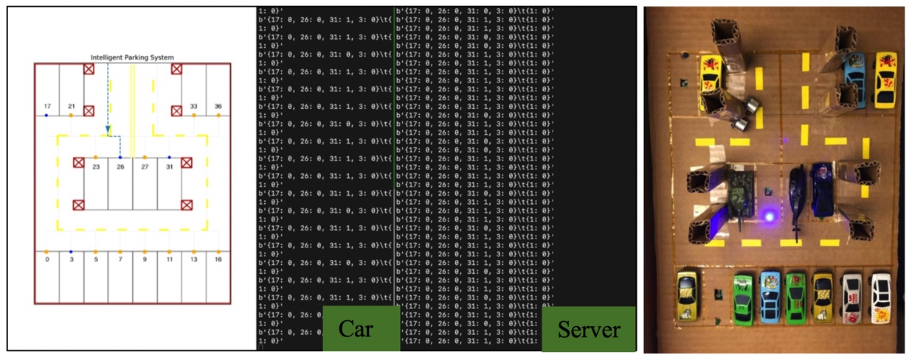

  Figure4.2 Experiment process step 1  

Then the car knows the nearest parking space. It will drive to that parking space. During driving, it will encounter some pillars that will scratch the surface of the car which is very dangerous. So the ultrasonic sensor would send warning signal to the car. In the car terminal, the dangerous pillar would be plotted with a red cross and voice would broadcast “Warning, too close to pillars”. The figure below shows this situation.

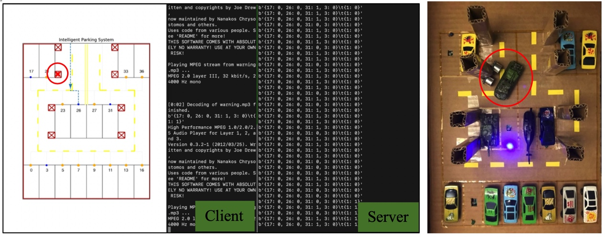

  Figure4.3 Experiment process step 2  

If a car entered the navigated parking lot, the light sensor would detected the car has arrived and 
Send “stop” signal to the car. The terminal of car would shut up the navigation map automatically and broadcast “Your navigation has ended”. The sever would shut down the LED light. Just like the figure below.

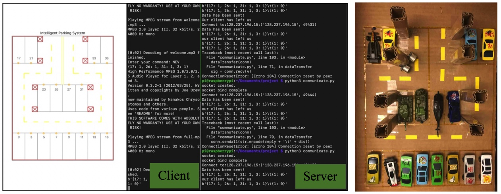

  Figure4.4 Experiment process step 3

Then if a new car is coming, and connect to the server again, it will do the navigation again. Here it didn’t consider the parking space 26 and choose 17 directly because we have parked a car on 26 parking space directly. The figure is shown as below.

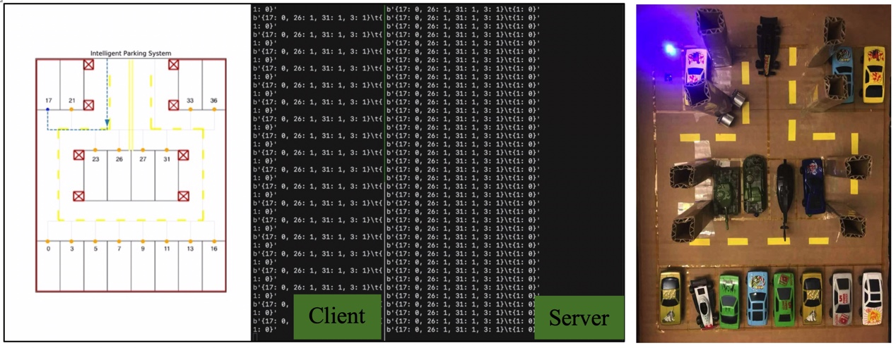

  Figure4.5 Experiment process step 4

If the new-coming car parked in the parking space 17, which means that this parking space don’t have empty parking space anymore. In this situation, the route plan system don’t plan route anymore and broadcast “The parking lot is full” and be shut down after ten minutes automatically. Meanwhile, the server won’t light up any LED light because no empty parking lot remain. The figure is show as below. 

  Figure4.6 Experiment process step 5

Until now, the teat has ended.

## 5. Discussion

In this project, we learned how to use raspberry pi, how to use sensor and connect circuit. We also learned how to do the IoT stuffs like using the openchirp do the real-time visualization and using socket to do the interdevice communication. And used our previous knowledge (like route planning) did this project that is very useful in the practical life and also let us know the data science progress better

However, this project also has some drawbacks that can be modified further if given enough time and money. For example, the project assume that all the car are coming sequentially, i.e one car must come until another car has parked. So how to do the parallel route planning is a very important modify point. Another drawback is that it can only plan route from the entrance because we don’t have GPS sensor and cannot know the exact position in the parking lot. It is also because the parking lot model is so small and using a GPS sensor has no meaning. So, if it possible, we would like to practice it in the real life.  Besides, we could design a GUI for the client’s program so everyone can stop looking at the black terminal.

Again, we want to thank Mario and TA’s help. Because their  advice are very important for this project to finish successfully.
